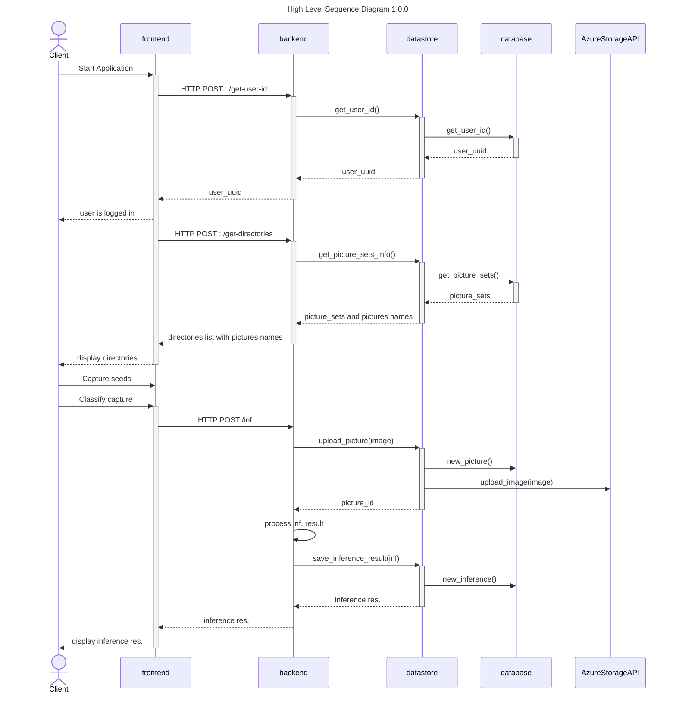

# :microscope: nachet-backend 🌱

## High level sequence diagram



### Details

- The backend was built with the [Quart](http://pgjones.gitlab.io/quart/)
  framework
- Quart is an asyncio reimplementation of Flask
- All HTTP requests are handled in `app.py` in the root folder
- Calls to Azure Blob Storage and the database are handled in the `nachet-backend/storage/datastore_storage_api.py` file that call the [datastore](https://github.com/ai-cfia/ailab-datastore) repo that handles the data 
- Inference results from model endpoint are directly handled in
  `model_inference/inference.py`

****

### RUNNING NACHET-BACKEND FROM DEVCONTAINER

When developping you first need to install the packages required.

This command must be run the **first time** you want to run the backend on your
computer, but also **every time** you update the requirements.txt file and
**every time** the datastore repo is updated

```bash
pip install -r requirements.txt
```

Then, you can run the backend while in the devcontainer by using this command:

```bash
hypercorn -b :8080 app:app
```

### RUNNING NACHET-BACKEND AS A DOCKER CONTAINER

If you want to run the program as a Docker container (e.g., for production),
use:

```bash
docker build -t nachet-backend .
docker run -p 8080:8080 -e PORT=8080 -v $(pwd):/app nachet-backend
```

#### RUNNING NACHET-BACKEND WITH THE FRONTEND IN DOCKER

If you want to run the frontend and backend together in Docker, use:

```bash
docker-compose up --build
```

You can then visit the web client at `http://localhost:80`. The backend will be
build from the Dockerfile enabling preview of local changes and the frontend
will be pulled from our Github registry.

### TESTING NACHET-BACKEND

To test the program, use this command:

```bash
python -m unittest discover -s tests
```

### ENVIRONMENT VARIABLES

Start by making a copy of `.env.template` and renaming it `.env`. For the
backend to function, you will need to add the missing values:

- **NACHET_AZURE_STORAGE_CONNECTION_STRING**: Connection string to access
  external storage (Azure Blob Storage).
- **NACHET_DATA**: Url to access nachet-data repository
- **NACHET_BLOB_PIPELINE_NAME**: The name of the blob containing the pipeline.
- **NACHET_BLOB_PIPELINE_VERSION**: The version of the file containing the
  pipeline used.
- **NACHET_BLOB_PIPELINE_DECRYPTION_KEY**: The key to decrypt sensible data from
  the models.
- **NACHET_VALID_EXTENSION**: Contains the valid image extensions that are
  accepted by the backend
- **NACHET_VALID_DIMENSION**: Contains the valid dimensions for an image to be
  accepted in the backend.
- **NACHET_MAX_CONTENT_LENGTH**: Set the maximum size of the file that can be
  uploaded to the backend. Needs to be the same size as the
  `client_max_body_size`
  [value](https://github.com/ai-cfia/howard/blob/dedee069f051ba743122084fcb5d5c97c2499359/kubernetes/aks/apps/nachet/base/nachet-ingress.yaml#L13)
  set from the deployment in Howard.

#### DEPRECATED

- **NACHET_MODEL_ENDPOINT_REST_URL**: Endpoint to communicate with deployed
  model for inferencing.
- **NACHET_MODEL_ENDPOINT_ACCESS_KEY**: Key used when consuming online endpoint.
- **NACHET_SUBSCRIPTION_ID**: Was used to retrieve models metadata
- **NACHET_WORKSPACE**: Was used to retrieve models metadata
- **NACHET_RESOURCE_GROUP**: Was used to retrieve models metadata
- **NACHET_MODEL**: Was used to retrieve models metadata

****

### DEPLOYING NACHET

If you need help deploying Nachet for your own needs, please contact us at
<cfia.ai-ia.acia@inspection.gc.ca>.
