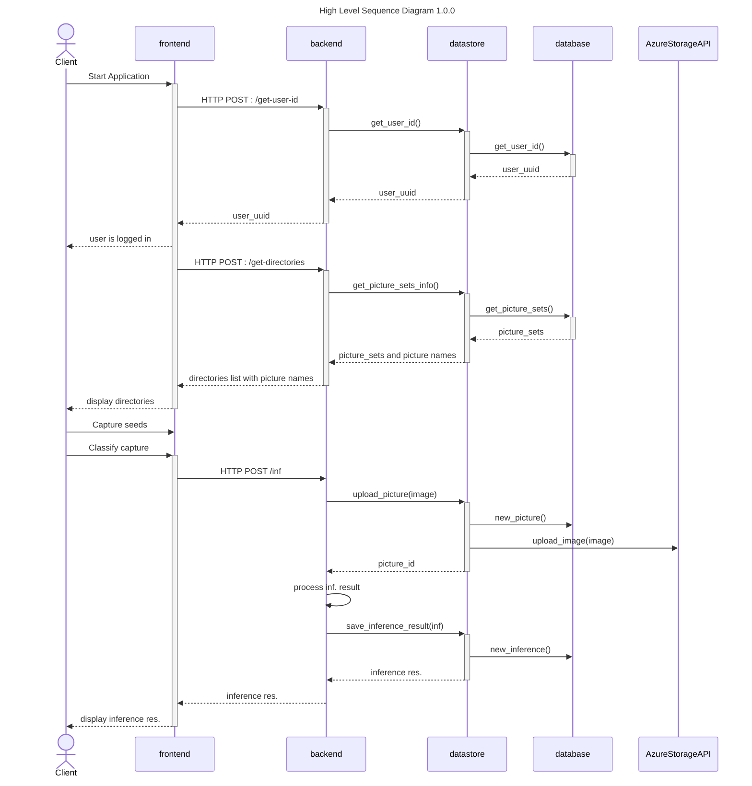
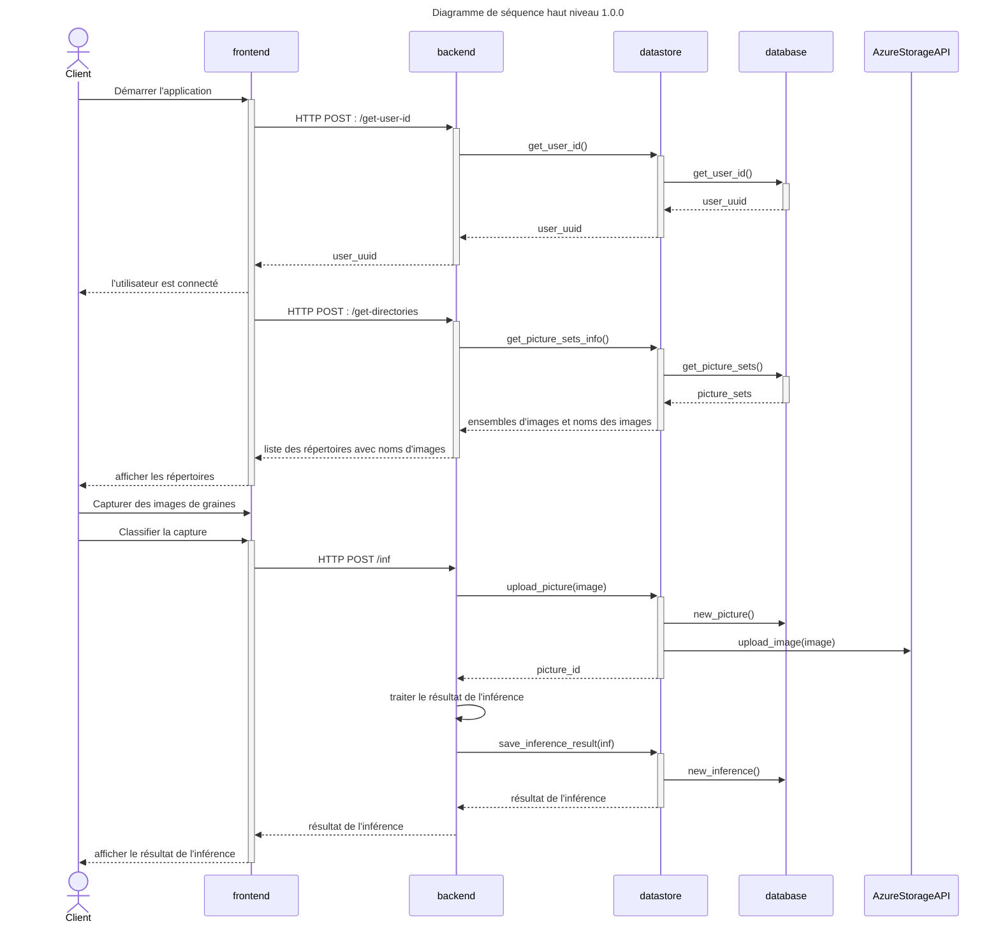

# :microscope: nachet-backend 🌱

([*Le français est disponible au bas de la
page*](#nachet-backend-fr))

## Table of Contents

- [High level sequence diagram](#high-level-sequence-diagram)
- [Details](#details)
- [RUNNING NACHET-BACKEND FROM DEVCONTAINER](#running-nachet-backend-from-devcontainer)
- [RUNNING NACHET-BACKEND AS A DOCKER CONTAINER](#running-nachet-backend-as-a-docker-container)
  - [RUNNING NACHET-BACKEND WITH THE FRONTEND IN DOCKER](#running-nachet-backend-with-the-frontend-in-docker)
- [TESTING NACHET-BACKEND](#testing-nachet-backend)
- [ENVIRONMENT VARIABLES](#environment-variables)
  - [DEPRECATED](#deprecated)
- [DEPLOYING NACHET](#deploying-nachet)
- [Diagramme de séquence haut niveau](#diagramme-de-séquence-haut-niveau)
- [Détails](#détails)
- [EXÉCUTER NACHET-BACKEND DEPUIS UN DEVCONTAINER](#exécuter-nachet-backend-depuis-un-devcontainer)
- [EXÉCUTER NACHET-BACKEND EN TANT QUE CONTENEUR DOCKER](#exécuter-nachet-backend-en-tant-que-conteneur-docker)
  - [EXÉCUTER NACHET-BACKEND AVEC LE FRONTEND DANS DOCKER](#exécuter-nachet-backend-avec-le-frontend-dans-docker)
- [TESTER NACHET-BACKEND](#tester-nachet-backend)
- [VARIABLES D'ENVIRONNEMENT](#variables-denvironnement)
  - [DÉPRÉCIÉES](#dépréciées)
- [DÉPLOYER NACHET](#déployer-nachet)

## High level sequence diagram


```mermaid
sequenceDiagram

  title: High Level Sequence Diagram 1.0.0
  actor Client
  participant frontend
  participant backend
  participant datastore
  participant database
  participant AzureStorageAPI

Client->>+frontend: Start Application
frontend->>+backend: HTTP POST : /get-user-id
backend->>+datastore: get_user_id()
datastore->>+database: get_user_id()
database-->>-datastore: user_uuid
datastore-->>-backend: user_uuid
backend-->>-frontend: user_uuid
frontend-->>Client: user is logged in
frontend->>+backend: HTTP POST : /get-directories
backend->>+datastore: get_picture_sets_info()
datastore->>+database: get_picture_sets()
database-->>-datastore: picture_sets
datastore-->>-backend: picture_sets and picture names
backend-->>-frontend: directories list with picture names
frontend-->>-Client: display directories
Client->>frontend: Capture seeds
Client->>+frontend: Classify capture
frontend->>backend: HTTP POST /inf
backend->>+datastore: upload_picture(image)
datastore->>database: new_picture()
datastore->>AzureStorageAPI: upload_image(image)
datastore-->>-backend: picture_id
backend->>backend: process inf. result
backend->>+datastore: save_inference_result(inf)
datastore->>database: new_inference()
datastore-->>-backend: inference res.
backend-->>frontend: inference res.
frontend-->>-Client: display inference res.
```

### Details

- The backend was built with the [Quart](http://pgjones.gitlab.io/quart/)
  framework
- Quart is an asyncio reimplementation of Flask
- All HTTP requests are handled in `app.py` in the root folder
- Calls to Azure Blob Storage and the database are handled in the
  `nachet-backend/storage/datastore_storage_api.py` file that calls the
  [datastore](https://github.com/ai-cfia/ailab-datastore) repo which handles the
  data
- Inference results from the model endpoint are directly handled in
  `model_inference/inference.py`

### RUNNING NACHET-BACKEND FROM DEVCONTAINER

When developping you first need to install the required packages.

This command must be run the **first time** you want to run the backend on your
computer, but also **every time** you update the requirements.txt file or if the
datastore repo is updated.

```bash
pip install -r requirements.txt
```

Then, you can run the backend while in the devcontainer by using this command:

```bash
hypercorn -b :8080 app:app
```

### RUNNING NACHET-BACKEND AS A DOCKER CONTAINER

If you want to run the program as a Docker container (e.g., for production),
use:

```bash
docker build -t nachet-backend .
docker run -p 8080:8080 -e PORT=8080 -v $(pwd):/app nachet-backend
```

#### RUNNING NACHET-BACKEND WITH THE FRONTEND IN DOCKER

If you want to run the frontend and backend together in Docker, use:

```bash
docker-compose up --build
```

You can then visit the web client at `http://localhost:80`. The backend will be
built from the Dockerfile enabling preview of local changes and the frontend
will be pulled from our Github registry.

### TESTING NACHET-BACKEND

To test the program, use this command:

```bash
python -m unittest discover -s tests
```

### ENVIRONMENT VARIABLES

Start by making a copy of `.env.template` and renaming it `.env`. For the
backend to function, you will need to add the missing values:

- **NACHET_AZURE_STORAGE_CONNECTION_STRING**: Connection string to access
  external storage (Azure Blob Storage).
- **NACHET_DATA**: Url to access nachet-data repository
- **NACHET_BLOB_PIPELINE_NAME**: The name of the blob containing the pipeline.
- **NACHET_BLOB_PIPELINE_VERSION**: The version of the file containing the
  pipeline used.
- **NACHET_BLOB_PIPELINE_DECRYPTION_KEY**: The key to decrypt sensitigve data
  from the models.
- **NACHET_VALID_EXTENSION**: Contains the valid image extensions that are
  accepted by the backend
- **NACHET_VALID_DIMENSION**: Contains the valid dimensions for an image to be
  accepted in the backend.
- **NACHET_MAX_CONTENT_LENGTH**: Set the maximum size of the file that can be
  uploaded to the backend. Needs to be the same size as the
  `client_max_body_size`
  [value](https://github.com/ai-cfia/howard/blob/dedee069f051ba743122084fcb5d5c97c2499359/kubernetes/aks/apps/nachet/base/nachet-ingress.yaml#L13)
  set from the deployment in Howard.

#### DEPRECATED

- **NACHET_MODEL_ENDPOINT_REST_URL**: Endpoint to communicate with deployed
  model for inferencing.
- **NACHET_MODEL_ENDPOINT_ACCESS_KEY**: Key used when consuming online endpoint.
- **NACHET_SUBSCRIPTION_ID**: Was used to retrieve model metadata
- **NACHET_WORKSPACE**: Was used to retrieve model metadata
- **NACHET_RESOURCE_GROUP**: Was used to retrieve model metadata
- **NACHET_MODEL**: Was used to retrieve model metadata

### DEPLOYING NACHET

If you need help deploying Nachet for your own needs, please contact us at
<cfia.ai-ia.acia@inspection.gc.ca>.

---

## nachet-backend (FR)

## Diagramme de séquence haut niveau


```mermaid
sequenceDiagram

  title: Diagramme de séquence haut niveau 1.0.0
  actor Client
  participant frontend
  participant backend
  participant datastore
  participant database
  participant AzureStorageAPI

Client->>+frontend: Démarrer l'application
frontend->>+backend: HTTP POST : /get-user-id
backend->>+datastore: get_user_id()
datastore->>+database: get_user_id()
database-->>-datastore: user_uuid
datastore-->>-backend: user_uuid
backend-->>-frontend: user_uuid
frontend-->>Client: l'utilisateur est connecté
frontend->>+backend: HTTP POST : /get-directories
backend->>+datastore: get_picture_sets_info()
datastore->>+database: get_picture_sets()
database-->>-datastore: picture_sets
datastore-->>-backend: ensembles d'images et noms des images
backend-->>-frontend: liste des répertoires avec noms d'images
frontend-->>-Client: afficher les répertoires
Client->>frontend: Capturer des images de graines
Client->>+frontend: Classifier la capture
frontend->>backend: HTTP POST /inf
backend->>+datastore: upload_picture(image)
datastore->>database: new_picture()
datastore->>AzureStorageAPI: upload_image(image)
datastore-->>-backend: picture_id
backend->>backend: traiter le résultat de l'inférence
backend->>+datastore: save_inference_result(inf)
datastore->>database: new_inference()
datastore-->>-backend: résultat de l'inférence
backend-->>frontend: résultat de l'inférence
frontend-->>-Client: afficher le résultat de l'inférence
```

### Détails

- Le backend est développé avec le framework
  [Quart](http://pgjones.gitlab.io/quart/).
- Quart est une réimplémentation asynchrone de Flask.
- Toutes les requêtes HTTP sont gérées dans `app.py` à la racine du projet.
- Les appels à Azure Blob Storage et à la base de données sont gérés dans le
  fichier `nachet-backend/storage/datastore_storage_api.py`, qui appelle le
  dépôt [datastore](https://github.com/ai-cfia/ailab-datastore) pour gérer les
  données.
- Les résultats d'inférences provenant du point de terminaison du modèle sont
  directement traités dans `model_inference/inference.py`.

### EXÉCUTER NACHET-BACKEND DEPUIS UN DEVCONTAINER

Lors du développement, vous devez d'abord installer les paquets nécessaires.

Cette commande doit être exécutée **la première fois** que vous lancez le
backend sur votre ordinateur, mais aussi **à chaque mise à jour** du fichier
`requirements.txt` ou du dépôt datastore.

```bash
pip install -r requirements.txt
```

Ensuite, vous pouvez exécuter le backend dans un devcontainer avec cette
commande :

```bash
hypercorn -b :8080 app:app
```

### EXÉCUTER NACHET-BACKEND EN TANT QUE CONTENEUR DOCKER

Pour exécuter le programme en tant que conteneur Docker (par exemple, en
production), utilisez :

```bash
docker build -t nachet-backend .
docker run -p 8080:8080 -e PORT=8080 -v $(pwd):/app nachet-backend
```

#### EXÉCUTER NACHET-BACKEND AVEC LE FRONTEND DANS DOCKER

Pour exécuter le frontend et le backend ensemble dans Docker, utilisez :

```bash
docker-compose up --build
```

Vous pouvez ensuite accéder au client web à l'adresse <http://localhost:80>. Le
backend sera construit à partir du Dockerfile, permettant un aperçu des
modifications locales, et le frontend sera récupéré depuis notre registre
GitHub.

### TESTER NACHET-BACKEND

Pour tester le programme, utilisez cette commande :

```bash
python -m unittest discover -s tests
```

### VARIABLES D'ENVIRONNEMENT

Commencez par faire une copie de `.env.template` et renommez-la en `.env`. Pour
que le backend fonctionne, vous devrez compléter les valeurs manquantes :

- **NACHET_AZURE_STORAGE_CONNECTION_STRING** : Pour accéder au stockage externe
  (Azure Blob Storage).
- **NACHET_DATA** : URL pour accéder au dépôt nachet-data.
- **NACHET_BLOB_PIPELINE_NAME** : Nom du blob contenant le pipeline.
- **NACHET_BLOB_PIPELINE_VERSION** : Version du fichier contenant le pipeline
  utilisé.
- **NACHET_BLOB_PIPELINE_DECRYPTION_KEY** : Clé pour déchiffrer les données
  sensibles des modèles.
- **NACHET_VALID_EXTENSION** : Extensions d'images valides acceptées par le
  backend.
- **NACHET_VALID_DIMENSION** : Dimensions valides pour qu'une image soit
  acceptée par le backend.
- **NACHET_MAX_CONTENT_LENGTH** : Taille maximale des fichiers pouvant être
  téléversés vers le backend. Doit correspondre à la valeur
  `client_max_body_size`
  [définie](https://github.com/ai-cfia/howard/blob/dedee069f051ba743122084fcb5d5c97c2499359/kubernetes/aks/apps/nachet/base/nachet-ingress.yaml#L13)
  lors du déploiement dans Howard.

#### DÉPRÉCIÉES

- **NACHET_MODEL_ENDPOINT_REST_URL** : Point de terminaison pour communiquer
  avec le modèle déployé pour l'inférence.
- **NACHET_MODEL_ENDPOINT_ACCESS_KEY** : Clé utilisée pour consommer le point de
  terminaison en ligne.
- **NACHET_SUBSCRIPTION_ID** : Utilisée pour récupérer les métadonnées des
  modèles.
- **NACHET_WORKSPACE** : Utilisé pour récupérer les métadonnées des modèles.
- **NACHET_RESOURCE_GROUP** : Utilisé pour récupérer les métadonnées des
  modèles.
- **NACHET_MODEL** : Utilisé pour récupérer les métadonnées des modèles.

### DÉPLOYER NACHET

Si vous avez besoin d'aide pour déployer Nachet pour vos propres besoins,
veuillez nous contacter à <cfia.ai-ia.acia@inspection.gc.ca>.
