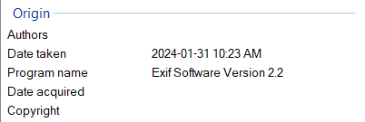
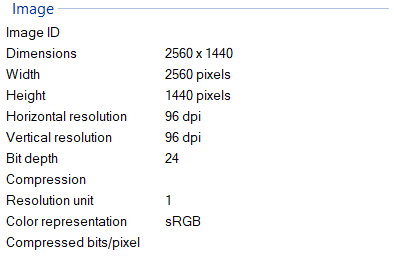
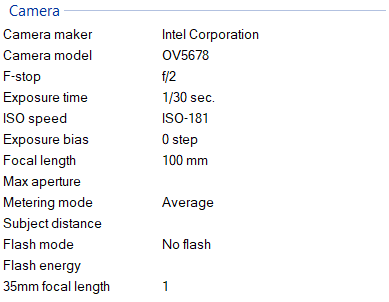
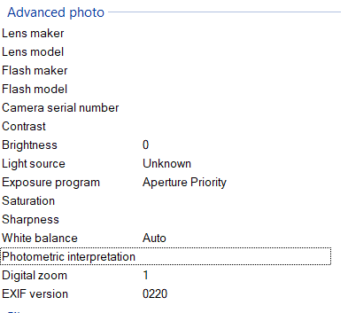
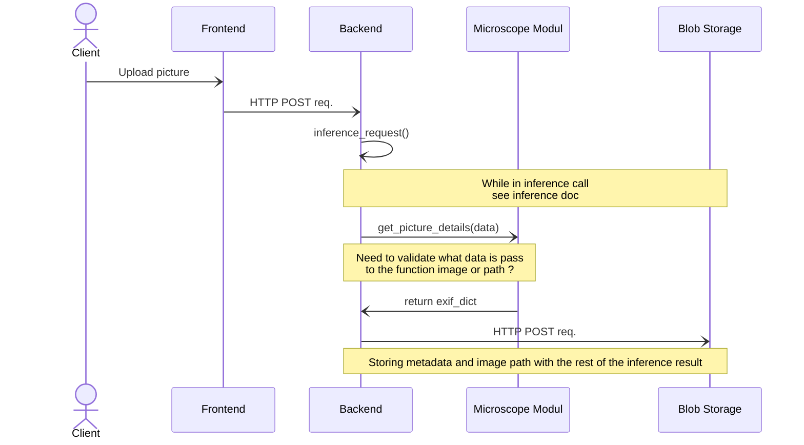

# Targano API Objective

## Main objective for milestones 1
The main objective of the Tagarno API integration is to be able to retrieve data
from the image taken by the microscope to build a trust threshold. For example,
we want to build confidence level, base on the condition and configuration a
picture was taken. Having data on this will help build a confidence level in
Nachet prediction.

### Opportunity Tagarno API
---
Tagarno is offering an API that can retrieve and set the config of the
microscope. However, there is no function that return all the config at once.

[Tagarno API
documentation](https://t6x6f6w2.rocketcdn.me/wp-content/uploads/2022/12/TAGARNO-Microscope-API-Documentation.pdf)

### Opportunity Picture Properties
---

When a picture is taken, a lot of metadata is record. See
[exif](#exif-information-in-image) for more.

For example :

#### Origin properties of image:

#### Image properties:

#### Camera properties of image:

#### Advanced photo properties of image:

#### File properties of image:

Lot's of the recording is also in the Tagarno API (White balance, contrast,
brightness, etc.). If we cross references the data with Tagarno API, we could be
able to only call specific Tagarno function to get a full configuration dataset.

### Tagarno API Get functions:
|Function|Configuration|
---|---
|getSerial|Request the serial number of the microscope|
|getVersion|Request the application version of the microscope|
|getFieldOfView|Request the current horizontal filed of view in micromillimiter|
|getZoomDirect|Request the current zoom directly from the camera module|
|getFocusDirect|Request the current focus directly from the camera module|
|getAutoFocusMode|Request the current focus mode|
|getAutoExposureMode|Request the current exposure mode|
|getExposureCompensation|Request the current exposure compensation|
|getManualIris|Request the current manual Iris value|
|getManualGain|Request the current manual gain value|
|getManualExposureTime|Request the current manual exposure time| 
|getContrast|Request the position of the Contrast slider in Advanced camera settings|
|getSaturation|Request the position of the Saturation slider in Advanced camera settings|
|getSharpness|Request the position of the Sharpness slider in Advanced camera settings| 
|getNoiseReduction|Request the position of the Sharpness slider in Advanced camera settings|
|getWhiteBalanceCalibration|Request red and blue calibration gain values|

### Other Tagarno API utilitary functions:
|Function|params|return|
---|---|---
|captureImage|[bmp, tiff, png, jpg]|return base64 encoded image|
|executeWhiteBalanceCalibration|None|Execute white balance calibration|

### Exif information in Image
---

#### What is exif?
Exif (Exchangeable image file format) a standard that specifies formats for
images, sound, and ancillary tags used by digital cameras (including
smartphones), scanners and other systems handling image and sound files recorded
by digital cameras. [Wikipédia](https://en.wikipedia.org/wiki/Exif)

This format record information that is present in the property of a picture
under details.

### List of validation
---
- [ ] Validate that Tagarno image produce exif metadata
- [ ] Validate that image coming from frontend also produced exif metadata
- [ ] Find another way to collect metadata from image if they don't recorded
  exif
- [ ] Incorporate tiff tag into the functionnality since Tagarno image are .tiff
  extension
- [ ] Waiting for Jack to return email on API

### get exif function
