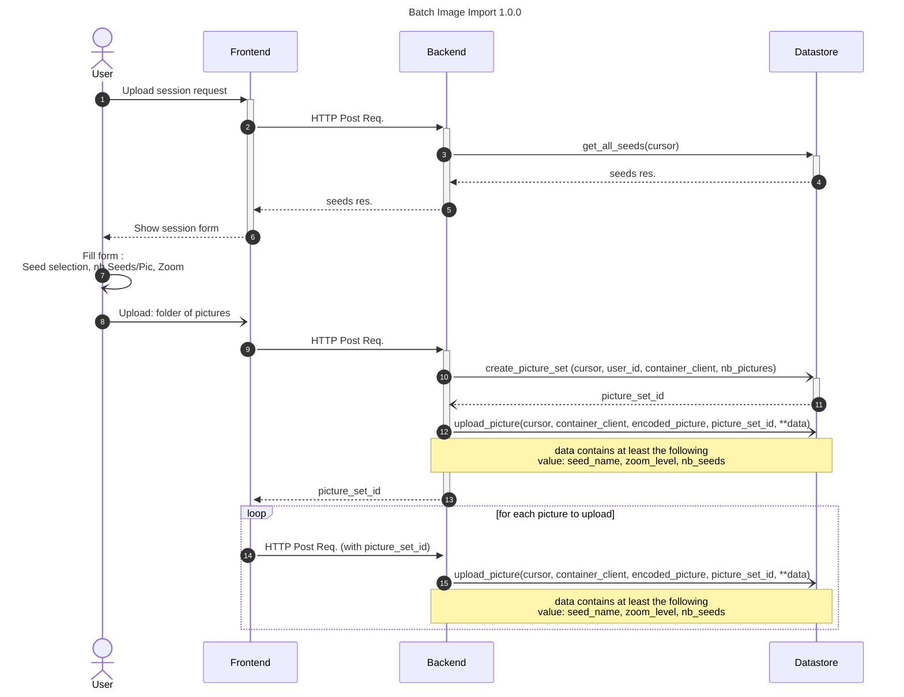

# Import Folder Images

## Executive summary

With the development of the datastore for Nachet, new opportunities arise. One
of them is to build a functionality to allow our thrust users to perform a batch
import of images into the database. With the introduction of this new feature,
users can now import an entire image folder at once, drastically reducing the
time and effort required.

Previously, users had to manually upload images into the blob storage, which was
a time-consuming process, especially when dealing with large volumes of data.
With the introduction of this feature, users will be able to import images for
AI training with Nachet directly, which simplifies the image import process but
also enhances the system’s overall efficiency and usability.

## Prerequisites

- The user must be signed in and have an Azure Storage Container
- The backend need to have a connection with the datastore

## Solution

To meet users' need to upload a batch of pictures in the blob storage using the Nachet interface we need to implement different endpoints in the backend.
First of all, we need to create a folder in the user container. In the database this will be related to the picture_set table.
Once we have the identifier of a picture_set, it will be used by the front-end to send each image, one by one, to the second end-point, mentioning the picture_set it belongs to.
Each image is then uploaded to blob storage and a row is added to the database's picture table.

As we're downloading images one by one, we could run into problems if we have to import a very large number of images, which could take a long time.
For the moment, we're implementing a first version of batch import with the front-end calling the back-end for each image, but we may have to cache the images in the back-end and send them in batches to the datastore depending on the quantity of images to be downloaded.

## Sequence Diagram

The complete diagram is part of the datastore documentation. You can see it
here:

[Trusted user upload process](https://github.com/ai-cfia/nachet-datastore/blob/issue13-create-process-to-upload-metadata-for-trusted-users/doc/trusted-user-upload.md)

## API Routes

### /get-user-id

The `get-user-id` route retrieve the user-id for a given email.

### /seeds

The `seeds` is the route to call to get the all the seeds names needed for
the frontend to build the form to upload the pictures to the database.

### /new-batch-import

The `/new-batch-import` route is the endpoint that the frontend call to start a batch import.
It save the number of pictures of the import and it return the new picture_set_id as a session id

### /upload-picture

The `/upload-pictures` route is the API endpoint responsible to assure the transit
of the picture to the database. The frontend might send the session id so the picture is associate to the right picture_set
