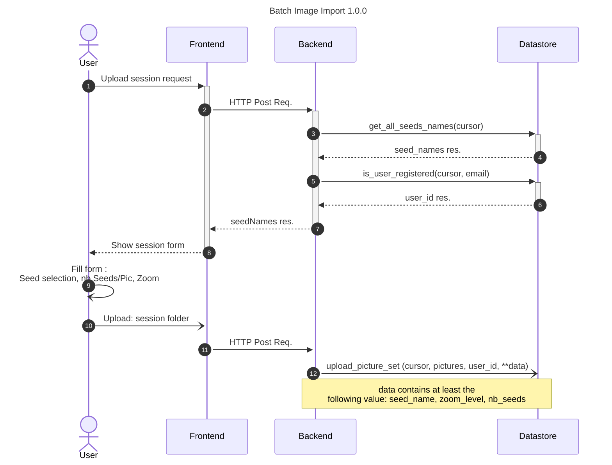

# Import Folder Images

## Executive summary

With the development of the datastore for Nachet, new opportunities arise. One
of them is to build a functionality to allow our thrust users to perform a batch
import of images into the database. With the introduction of this new feature,
users can now import an entire image folder at once, drastically reducing the
time and effort required.

Previously, users had to manually upload images into the blob storage, which was
a time-consuming process, especially when dealing with large volumes of data.
With the introduction of this feature, users will be able to import images for
AI training with Nachet directly, which simplifies the image import process but
also enhances the system’s overall efficiency and usability.

## Prerequisites

- The backend need to have a connection with the datastore

## Sequence Diagram

The complete diagram is part of the datastore documentation. You can see it
here:

[Trusted user upload process](https://github.com/ai-cfia/nachet-datastore/blob/issue13-create-process-to-upload-metadata-for-trusted-users/doc/trusted-user-upload.md)

### API Route

#### /picture-form

The `picture-form` is the route to call to get all the information needed for
the frontend to build the form to upload the pictures to the database.

#### /batch-import

The `/batch-import` route is the API endpoint responsible to assure the transit
of the picture to the database.
