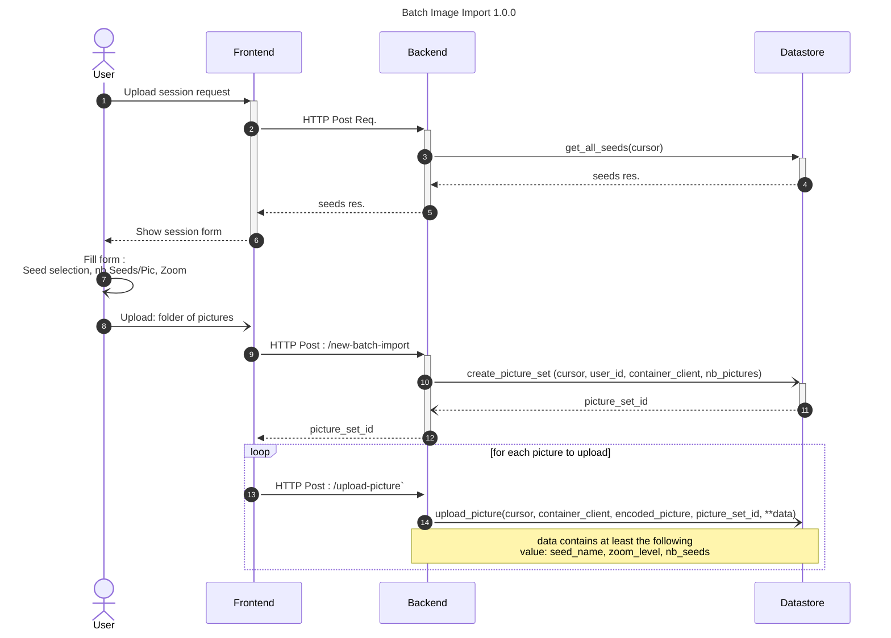
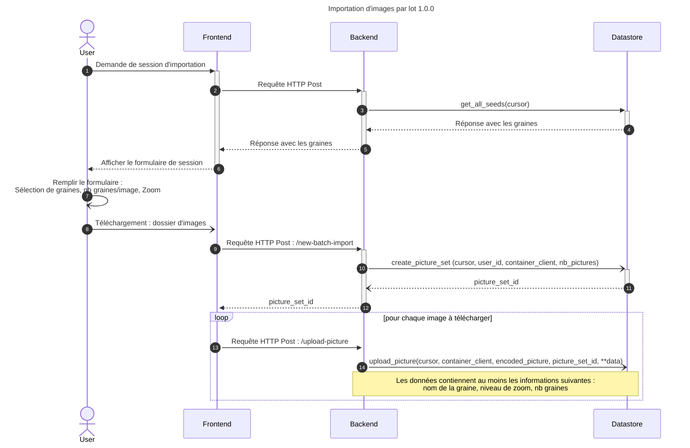

# Batch Upload of Images

([*Le français est disponible au bas de la page*](#téléversement-dimages-par-lot))

## Table of Contents
- [Executive Summary](#executive-summary)
- [Prerequisites](#prerequisites)
- [Solution](#solution)
- [Sequence Diagram](#sequence-diagram)
- [API Routes](#api-routes)
  - [/get-user-id](#get-user-id)
  - [/seeds](#seeds)
  - [/new-batch-import](#new-batch-import)
  - [/upload-picture](#upload-picture)
- [Téléversement d'images par lot](#téléversement-dimages-par-lot)
  - [Sommaire](#sommaire)
  - [Prérequis](#prérequis)
  - [Solution](#solution-1)
  - [Diagramme de séquence](#diagramme-de-séquence)
  - [API](#api)
    - [Route /get-user-id](#route-get-user-id)
    - [Route /seeds](#route-seeds)
    - [Route /new-batch-import](#route-new-batch-import)
    - [Route /upload-picture](#route-upload-picture)

## Executive Summary

With the development of the datastore for Nachet, new opportunities arise. One
of them is to build a functionality to allow our trusted users to perform a
batch import of images into the database. With the introduction of this new
feature, users can now import an entire image folder at once, drastically
reducing the time and effort required.

Previously, users had to manually upload images into the blob storage, which was
a time-consuming process, especially when dealing with large volumes of data.
With the introduction of this feature, users will be able to import images for
AI training with Nachet directly, which simplifies the image import process but
also enhances the system’s overall efficiency and usability.

## Prerequisites

- The user must be signed in and have an Azure Storage Container
- The backend must be connected with the datastore

## Solution

To meet users' need to upload a batch of pictures in the blob storage using the
Nachet interface we need to implement different endpoints in the backend. First
of all, we need to create a folder in the user container. In the database this
will be related to the picture_set table. Once we have the identifier of a
picture_set, it will be used by the frontend to send each image, one by one, to
the second endpoint, mentioning the picture_set it belongs to. Each image is
then uploaded to the blob storage and a row is added to the database's picture
table.

As we're downloading images one by one, we could run into problems if we have to
import a very large number of images, which could take a long time. For the
moment, we're implementing a first version of batch import with the frontend
calling the backend for each image, but we may have to cache the images in the
backend and send them in batches to the datastore depending on the quantity of
images to be downloaded.

## Sequence Diagram

The complete diagram is part of the datastore documentation. You can see it
here:

[Trusted user upload
process](https://github.com/ai-cfia/nachet-datastore/blob/issue13-create-process-to-upload-metadata-for-trusted-users/doc/trusted-user-upload.md)

## API Routes

### /get-user-id

The `/get-user-id` route retrieves the user-id for a given email.

### /seeds

The `/seeds` route retrieves all the seed names needed for the frontend to build
the form to upload the pictures to the database.

### /new-batch-import

The `/new-batch-import` route is the endpoint that the frontend calls to start a
batch import. It saves the number of pictures of the import and it returns the
new picture_set_id as a session id.

### /upload-picture

The `/upload-picture` route is the endpoint responsible to ensure the transit of
the picture to the database. The frontend might send the session id so the
picture is associated to the correct picture_set.

---

## Téléversement d'images par lot

## Sommaire

Avec le développement du datastore pour Nachet, de nouvelles opportunités
émergent. L'une d'elles consiste à créer une fonctionnalité permettant aux
utilisateurs de confiance d'effectuer un import d'images par lot dans la base de
données. Grâce à cette nouvelle fonctionnalité, les utilisateurs peuvent
désormais importer un dossier entier d'images d'un coup, réduisant
considérablement le temps et les efforts nécessaires.

Auparavant, les utilisateurs devaient téléverser manuellement des images dans le
blob storage, ce qui était un processus long, en particulier pour des volumes de
données importants. Avec l'introduction de cette fonctionnalité, les
utilisateurs peuvent directement importer des images pour l'entraînement de l'IA
avec Nachet, ce qui simplifie non seulement le processus d'importation, mais
améliore également l'efficacité et la convivialité globale du système.

## Prérequis

- L'utilisateur doit être connecté et disposer d'un conteneur Azure Storage.
- Le backend doit avoir une connexion avec le datastore.

## Solution

Pour répondre au besoin des utilisateurs de télécharger un lot d'images dans le
blob storage via l'interface Nachet, nous devons implémenter différents points
de terminaison dans le backend. Tout d'abord, nous devons créer un dossier dans
le conteneur de l'utilisateur. Dans la base de données, cela sera lié à la table
`picture_set`. Une fois que nous avons l'identifiant d'un `picture_set`, il sera
utilisé par le frontend pour envoyer chaque image, une par une, au deuxième
point de terminaison, en mentionnant le `picture_set` auquel elle appartient.
Chaque image est ensuite téléversée dans le blob storage, et une ligne est
ajoutée à la table `picture` de la base de données.

Comme nous téléversons les images une par une, nous pourrions rencontrer des
problèmes si nous devons importer un très grand nombre d'images, ce qui pourrait
prendre beaucoup de temps. Pour l'instant, nous implémentons une première
version de l'importation par lot avec le frontend appelant le backend pour
chaque image, mais il pourrait être nécessaire de mettre en cache les images
dans le backend et de les envoyer en lots au datastore en fonction de la
quantité d'images à téléverser.

## Diagramme de séquence

## Processus de téléversement d'images par lot

Le diagramme complet fait partie de la documentation du **datastore**. Vous
pouvez le consulter ici :

[Processus de téléversement pour utilisateurs de
confiance](https://github.com/ai-cfia/nachet-datastore/blob/issue13-create-process-to-upload-metadata-for-trusted-users/doc/trusted-user-upload.md)

## API

### Route /get-user-id

La route `/get-user-id` permet de récupérer l'identifiant utilisateur
(`user-id`) associé à une adresse courriel.

### Route /seeds

La route `/seeds` retourne la liste des noms de graines nécessaires pour
permettre au frontend de construire le formulaire permettant de téléverser les
images dans la base de données.

### Route /new-batch-import

La route `/new-batch-import` est le point de terminaison appelé par le frontend
pour démarrer un téléversement par lot. Cette route enregistre le nombre
d'images à importer et retourne le nouvel identifiant de `picture_set` en tant
qu'identifiant de session.

### Route /upload-picture

La route `/upload-picture` est responsable d'assurer le transfert d'une image
vers la base de données. Le frontend doit fournir l'identifiant de session afin
d'associer l'image au bon `picture_set`.
