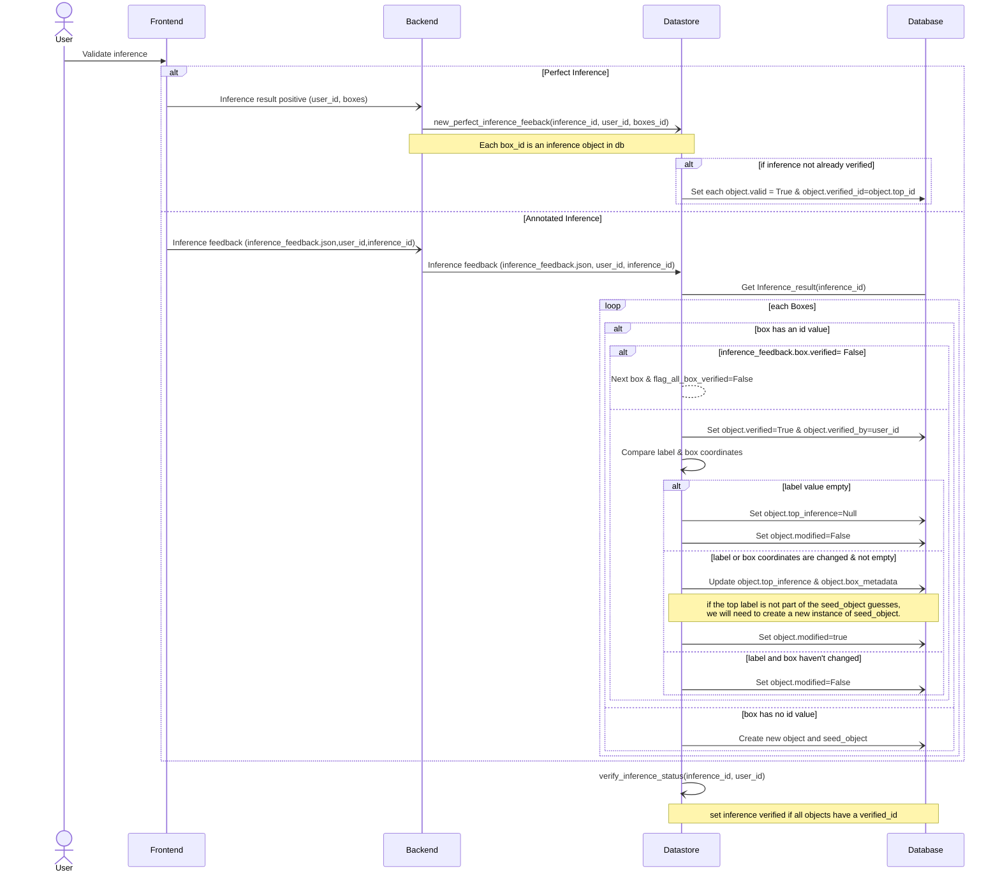
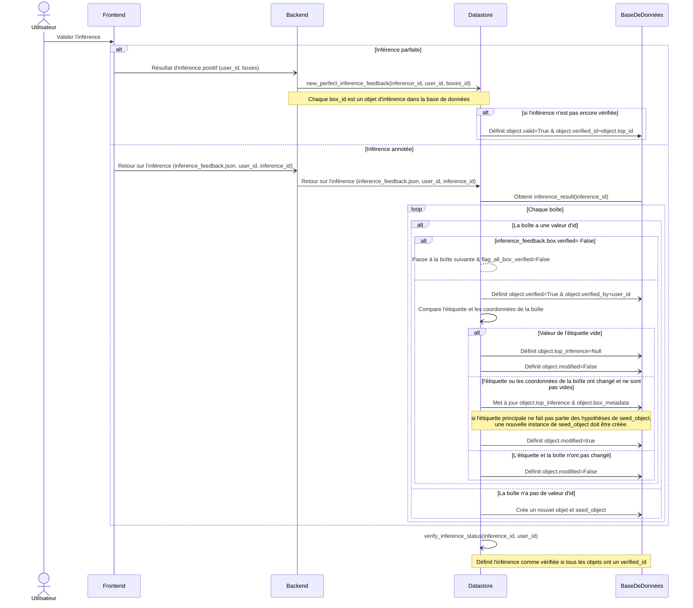

# Inference feedback

([*Le français est disponible au bas de la
page*](#rétroaction-sur-linférence))

## Executive summary

When seed analysts use Nachet, they should be able to give their feedback on the
result. A pipeline of action needs to be integrated from the Frontend to the
database to be able to register the user feedback. The possible feedback types
are:

- A perfect feedback (Doesn't change anything and validates the inference)
- A new guess is given by the analyst
- The box coordinates have changed
- The box is deleted (not a seed)
- A new box is added

## Prerequisites

- The user must be signed in and have an Azure Storage Container
- The backend needs to have a connection to the datastore
- The user can do an inference request

## Solution

The analyst selects the box for which he or she wishes to give feedback, and
then fills in a form containing information about its correction.
The frontend adapts this information and sends it to the backend, then,
according to each case of feedback, the datastore updates the inference and the
object.

## Sequence Diagram

## API Routes

### /get-user-id

The `/get-user-id` route retrieves the user-id for a given email.

### /seeds

The `/seeds` route retrieves all the seed names needed for the frontend to build
the form to upload the pictures to the database.

### /feedback-positive

The `/feedback-positive` route is the endpoint that the frontend calls to add a
positive feedback to an inference, giving the inference and the box to validate.

### /feedback-negative

The `/feedback-negative` route is the endpoint that sends the information to the
datastore for a correction feedback to be added to a given inference and box.

---

## Rétroaction sur l'inférence

## Sommaire

Lorsque les analystes de semences utilisent Nachet, ils doivent pouvoir donner
une rétroaction sur le résultat. Une chaîne d'actions doit être intégrée du
Frontend à la base de données pour enregistrer les retours des utilisateurs. Les
types de retours possibles sont :

- Un retour parfait (ne modifie rien et valide l'inférence)
- Une nouvelle hypothèse donnée par l'analyste
- Les coordonnées de la boîte ont changé
- La boîte est supprimée (pas une graine)
- Une nouvelle boîte est ajoutée

## Prérequis

- L'utilisateur doit être connecté et disposer d'un conteneur de stockage Azure
- Le backend doit être connecté au Datastore
- L'utilisateur doit pouvoir effectuer une demande d'inférence

## Solution

L'analyste sélectionne la boîte pour laquelle il ou elle souhaite donner un
retour, puis remplit un formulaire contenant une série d'informations sur sa
correction. Le frontend adapte ces informations et les envoie au backend. Selon
chaque cas de retour, le datastore met à jour l'inférence et l'objet associé.

## Diagramme de séquence

## Routes API

### /get-user-id

La route `/get-user-id` récupère l'ID utilisateur pour un e-mail donné.

### /seeds

La route `/seeds` permet d'obtenir tous les noms de graines nécessaires pour que
le frontend puisse créer le formulaire d'envoi des images vers la base de
données.

### /feedback-positive

La route `/feedback-positive` est le point d'entrée que le frontend appelle pour
ajouter un retour positif à une inférence, en spécifiant l'inférence et la boîte
à valider.

### /feedback-negative

La route `/feedback-negative` est le point d'entrée qui envoie les informations
au datastore pour qu'un retour correctif soit ajouté à une inférence et une
boîte spécifiques.
