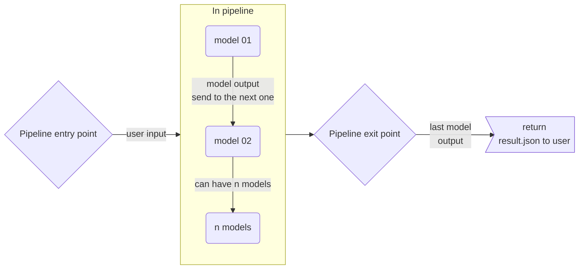
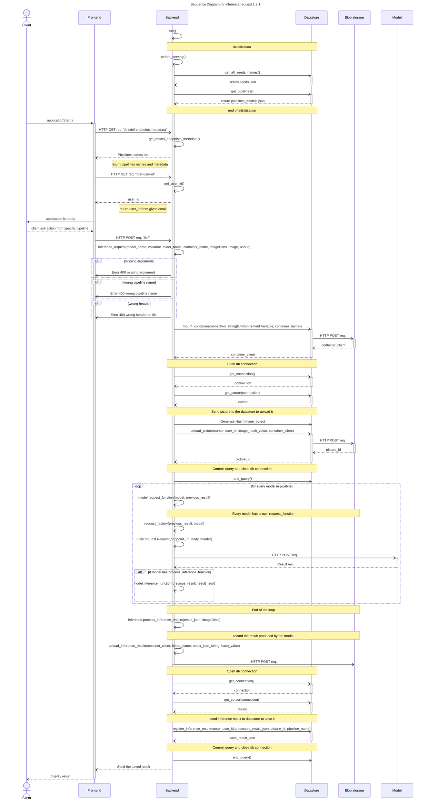

# Inference Request with n-models pipelines

## Executive summary

Nachet Interactive is currently working on improving the effectiveness and user
experience of detecting regulated seeds. To achieve this goal, the AI Lab is
implementing various AI models that can perform tasks such as seed detection in
an image or seed classification. These models can work together or independently
to enhance the accuracy of the results. When combined with other models, each
model builds upon the work of the previous one to deliver the final outcome.
This process is defined as a pipeline of models.

Each model produces a result based on its inference, which is the process of
machine learning to generate predictions from a dataset. The purpose of this
document is to provide a technical design for the implementation of the
inference request with multiple pipelines where the pipeline to run against is
selected by a parameter.

## Glossary

### Pipelines

Pipelines are defined as a set of models that follow each other, where the
output of one model is used as input for the next models, and so on. A pipeline
contains from 1 to n models.

#### Pipelines flowchart 1.0.0



### Models

A model is an AI model that is a part of a pipeline. A model accepts images as
input and returns JSON as output. Generally, this JSON contains the coordinates
of objects in the source image, that the model may pass along to feed the next
step of the pipeline.

### Model from Frontend

On the frontend interface, a pipeline will be called a model, because the user
will not be aware of the difference. From the user's perspective, they send data
to a model and receive the result.

*Suggestion: we could call the pipeline a method if we don't want to mix terms.*

## Sequence Diagram for inference request 1.2.1




### Inference Request function

The inference request function plays a crucial role in Nachet Interactive's
backend. It requests actions from selected models or pipelines based on certain
checks. These checks include verifying that all arguments required to find or
initialize the blob container and process the image have been transmitted to the
function. It also checks if the selected pipeline is recognized by the system
and if the image sent for analysis has a valid header.

If all the above checks pass, the function initializes or finds the user blob
container and uploads the image. Next, it requests an inference from every model
in the pipeline. Each model specifies their `request_function` (how to call and
retrieve data) and whether they have a `process_inference` function. Based on
these indications, the results are returned and stored in the cache.

If no other model is called, the last result is then processed and register by
the datastore. The inferences are saved so the users could give feedback for
training and statistics purposes. The inference result is then sent to the
frontend.

### Input and Output for inference request

The inference request will process the following parameters:

|Key parameters | Expected Value|
|--|--|
|model_name | The name of the pipeline|
|folder_name | The folder where the image is uploaded in the user's container|
|container_name | The user's container|
|imageDims | The dimension of the image|
|image | The image encoded in b64 (ASCII)|
|userId | The user's id in db

Note that since the information is received from the frontend, the model_name is
an abstraction for a pipeline.

The inference request will return a list with the following information:
|key parameters | hierarchy Levels | Return Value |
|--|--|--|
|Boxes | 0 | Contains all the boxes returned by the inference request|
|Filename| 0 | Contains the filename of the image|
|inference_id| 0 | Inference id after it has been saved in the database|
|labelOccurence | 0 | Contains the number of label occurence|
|totalBoxes | 0 | Boxes total number|
|models | 0 | Models of the pipeline|
|Box | 1 | Contains all the information of one seed in the image|
|box_id | 1 | box id after it has been saved in the database|
|label | 1 | Contains the top label for the seed|
|score | 1 | Contains the top score for the seed|
|topN | 1 | Contains the top N scores for the seed|
|top_id | 1 | id of the top result|
|overlapping | 1 | Contains a boolean to tell if the box overlap with another one|
|overlappingIndices | 1 | Contains the index of the overlapping box|
|topX | 2 | The top x value of the box around a seed|
|topY | 2 | The top y value of the box around a seed|
|bottomX | 2 | The bottom x value of the box around a seed|
|bottomY| 2 | The bottom y value of the box around a seed|

*for more look at
[nachet-model-documentation](https://github.com/ai-cfia/nachet-backend/blob/51-implementing-2-models/docs/nachet-model-documentation.md#return-value-of-models)*

**topN** contains the top 5 predictions of the models:

```json
"topN": [
    {
        "label": "seed_name",
        "object_id":"xxxx-xxxx-xxxx",
        "score": 0.75
    }
    {
        "label": "seed_name",
        "object_id":"xxxx-xxxx-xxxx",
        "score": 0.18
    }
    {
        "label": "seed_name",
        "object_id":"xxxx-xxxx-xxxx",
        "score": 0.05
    }
    {
        "label": "seed_name",
        "object_id":"xxxx-xxxx-xxxx",
        "score": 0.019
    }
    {
        "label": "seed_name",
        "object_id":"xxxx-xxxx-xxxx",
        "score": 0.001
    }
]
```

### Blob storage and Pipeline versioning

To keep track of the various pipeline iterations and versions, JSON files are
stored in the blob storage. Users can add the JSON to the blob storage using the
`pipelines_version_insertion.py` script. This allows for easy management of
model and pipeline history.

To use the script, 3 environment variables are necessary:

* NACHET_BLOB_PIPELINE_NAME
  * Containing the blob name where the pipelines are stored
* NACHET_BLOB_PIPELINE_VERSION
  * Containing the version the user wants to select
* NACHET_BLOB_PIPELINE_DECRYPTION_KEY
  * The key to decrypt sensible data such as the API key and the endpoint of a
    model.

#### In the code

In the backend, the pipelines are retrieved using the `get_pipelines` function
which call the get_ml_structure of the datastore. This function retrieves the
data from the database. Then the pipelines are stored in the `CACHE["endpoint"]`
variable. This is the variable that feeds the `models` information and metadata
to the frontend.

In the `app.py`

```python


async def get_pipelines(cipher_suite=Fernet(FERNET_KEY)):
    """
    Retrieves the pipelines from the Azure storage API.

    Returns:
    - list: A list of dictionaries representing the pipelines.
    """
    result_json = await datastore.get_pipelines()

    models = ()
    for model in result_json.get("models"):
        m = Model(
            request_function.get(model.get("model_name")),
            model.get("model_name"),
            model.get("version"),
            # To protect sensible data (API key and model endpoint), we encrypt it when
            # it's pushed into the blob storage. Once we retrieve the data here in the
            # backend, we need to decrypt the byte format to recover the original
            # data.
            cipher_suite.decrypt(model.get("endpoint").encode()).decode(),
            cipher_suite.decrypt(model.get("api_key").encode()).decode(),
            model.get("content_type"),
            model.get("deployment_platform")
        )
        models += (m,)
    # Build the pipeline to call the models in order in the inference request
    for pipeline in result_json.get("pipelines"):
        CACHE["pipelines"][pipeline.get("pipeline_name")] = tuple([m for m in models if m.name in pipeline.get("models")])

    return result_json.get("pipelines")
```

Then in the datastore module that call the datastore repo

```python
async def get_pipelines() -> list:

    """
    Retrieves the pipelines from the Datastore
    """
    try:
        connection = get_connection()
        cursor = get_cursor(connection)
        pipelines = await nachet_datastore.get_ml_structure(cursor)
        return pipelines
    except Exception as error: # TODO modify Exception for more specific exception
        raise GetPipelinesError(error.args[0])

```

### Available Version of the JSON file

|Version|Creation Date| Pipelines|
|--|--|--|
|0.1.4 | 2024-08-01 | Swin Transformer and 6 Seeds Detector|
|0.1.3 | 2024-03-26 | Swin Transformer and 6 Seeds Detector|
|0.1.0 | 2024-02-26 | Swin Transformer and 6 Seeds Detector|
|0.1.1 | 2024-03-14 | Swin Transformer and 6 Seeds Detector|
