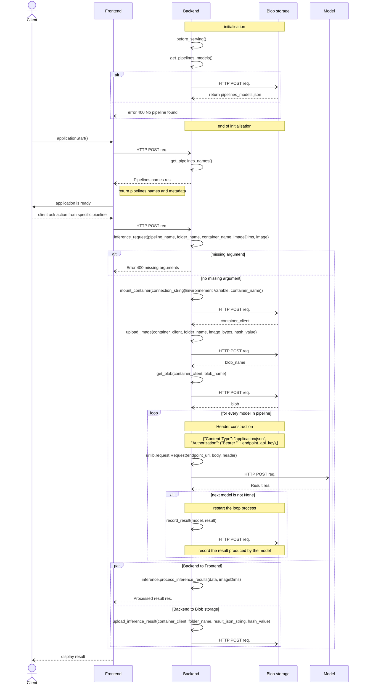

# Inference Request with n pipelines

## Executive summary

Nachet Interactive is working on improving the effectiveness and
experience of users in detecting regulated seeds. To achieve this objective, the
AI Lab is implementing various AI models that are capable of performing specific
tasks. These models can work together or independently to enhance the accuracy
of the results. When combined with other models, each model builds upon the work
of the previous one to deliver the final outcome. The purpose of this document
is to provide a technical design for the implementation of multi-model
functionality.

## Glossary

### Pipelines
Pipelines are defined as a set of models that follow each other, where the output of
one model is used as input for the next models, and so on. A pipeline contains from 1 to n
models.

#### Pipelines flowchart 1.0.0

### Models
A model is an AI model who is a part of a pipeline. A model accepts images as input
and returns JSON as output. Generally, this JSON contains the coordinates of objects in the
source image, that the model may pass along to feed the next step of the pipeline.

### Model from Frontend
On the frontend interface, a pipeline will be called a model, because the user will
not be aware of the difference. From the user'S perspective, they sent data to a
model and receive the result.

*Suggestion: we could call the pipeline a method, if we don't want to mix term.*

# Sequence Diagram for inference request 1.0.0

