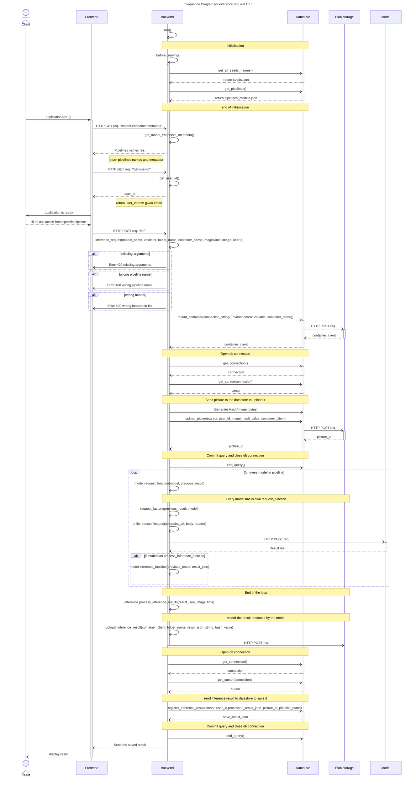
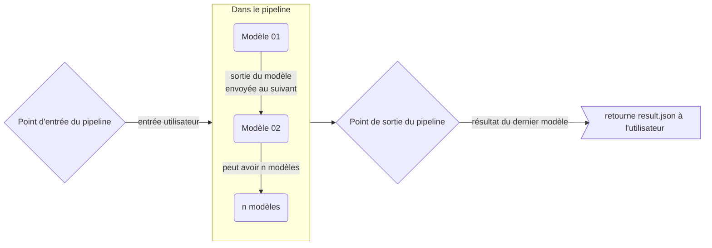
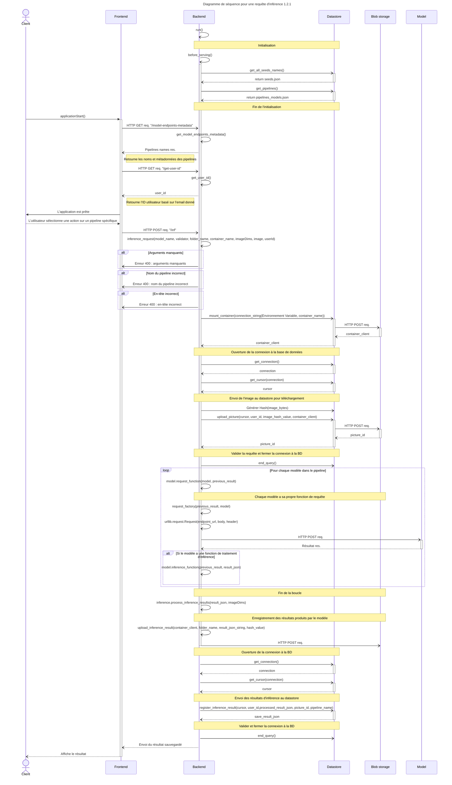

# Inference Request with n-models Pipelines

([*Le français est disponible au bas de la page*](#demande-dinférence-avec-des-pipelines-multi-modèles))

## Table of Contents

- [Executive Summary](#executive-summary)
- [Glossary](#glossary)
  - [Pipelines](#pipelines)
    - [Pipelines Flowchart 1.0.0](#pipelines-flowchart-100)
  - [Models](#models)
  - [Model from Frontend](#model-from-frontend)
- [Sequence Diagram for Inference Request 1.2.1](#sequence-diagram-for-inference-request-121)
- [Inference Request Function](#inference-request-function)
- [Input and Output for Inference Request](#input-and-output-for-inference-request)
- [Blob Storage and Pipeline Versioning](#blob-storage-and-pipeline-versioning)
  - [In the Code](#in-the-code)
- [Available Version of the JSON File](#available-version-of-the-json-file)

## Executive Summary

We are currently working on improving Nachet Interactive's effectiveness and
user experience for detecting regulated seeds. To achieve this goal, we are
implementing various AI models that can perform tasks such as seed detection in
an image or seed classification. These models can work together or independently
to enhance the accuracy of the results. When combined with other models, each
model builds upon the work of the previous one to deliver the final outcome.
This process is defined as a pipeline of models.

Each model produces a result based on its inference, which is the process of
machine learning to generate predictions from a dataset. The purpose of this
document is to provide a technical design for the implementation of the
inference request with multiple pipelines where the pipeline to run is selected
by a parameter.

## Glossary

### Pipelines

Pipelines are defined as a set of models that follow each other, where the
output of one model is used as input for the next model, and so on. A pipeline
contains from 1 to n models.

#### Pipelines Flowchart 1.0.0


### Models

A model is an AI model that is a part of a pipeline. A model accepts images as
input and returns JSON as output. Generally, this JSON contains the coordinates
of objects in the source image, that the model may pass along to feed the next
step of the pipeline.

### Model from Frontend

On the frontend, a pipeline is called a model, because the user will not be
aware of the difference. From the user's perspective, they send data to a model
and receive the result.

*Suggestion: we could call the pipeline a method if we don't want to mix terms.*

## Sequence Diagram for Inference Request 1.2.1




### Inference Request Function

The inference request function plays a crucial role in Nachet Interactive's
backend. It requests actions from selected models or pipelines based on certain
checks. These checks include verifying that all arguments required to find or
initialize the blob container and process the image have been transmitted to the
function. It also checks if the selected pipeline is recognized by the system
and if the image sent for analysis has a valid header.

If all the above checks pass, the function initializes or finds the user blob
container and uploads the image. Next, it requests an inference from every model
in the pipeline. Each model specifies their `request_function` (how to call and
retrieve data) and whether they have a `process_inference` function. Based on
these indications, the results are returned and stored in the cache.

If no other model is called, the last result is then processed and registered by
the datastore. The inferences are saved so the users could give feedback for
training and collect statistics. The inference result is then sent to the
frontend.

### Input and Output for Inference Request

The inference request will process the following parameters:

|Key parameters | Expected Value|
|--|--|
|model_name | The name of the pipeline|
|folder_name | The folder where the image is uploaded in the user's container|
|container_name | The user's container|
|imageDims | The dimension of the image|
|image | The image encoded in b64 (ASCII)|
|userId | The user's id in db

Note that since the information is received from the frontend, the `model_name`
is an abstraction for a pipeline.

The inference request will return a list with the following information: |key
parameters | hierarchy Levels | Return Value | |--|--|--| |Boxes | 0 | Contains
all the boxes returned by the inference request| |Filename| 0 | Contains the
filename of the image| |inference_id| 0 | Inference id after it has been saved
in the database| |labelOccurence | 0 | Contains the number of label occurences|
|totalBoxes | 0 | Boxes total number| |models | 0 | Models of the pipeline| |Box
| 1 | Contains all the information of one seed in the image| |box_id | 1 | box
id after it has been saved in the database| |label | 1 | Contains the top label
for the seed| |score | 1 | Contains the top score for the seed| |topN | 1 |
Contains the top N scores for the seed| |top_id | 1 | id of the top result|
|overlapping | 1 | Contains a boolean to tell if the box overlaps with another
one| |overlappingIndices | 1 | Contains the index of the overlapping box| |topX
| 2 | The top x value of the box around a seed| |topY | 2 | The top y value of
the box around a seed| |bottomX | 2 | The bottom x value of the box around a
seed| |bottomY| 2 | The bottom y value of the box around a seed|

*for more look at
[nachet-model-documentation](https://github.com/ai-cfia/nachet-backend/blob/51-implementing-2-models/docs/nachet-model-documentation.md#return-value-of-models)*

**topN** contains the models' top 5 predictions:

```json
"topN": [
    {
        "label": "seed_name",
        "object_id":"xxxx-xxxx-xxxx",
        "score": 0.75
    }
    {
        "label": "seed_name",
        "object_id":"xxxx-xxxx-xxxx",
        "score": 0.18
    }
    {
        "label": "seed_name",
        "object_id":"xxxx-xxxx-xxxx",
        "score": 0.05
    }
    {
        "label": "seed_name",
        "object_id":"xxxx-xxxx-xxxx",
        "score": 0.019
    }
    {
        "label": "seed_name",
        "object_id":"xxxx-xxxx-xxxx",
        "score": 0.001
    }
]
```

### Blob Storage and Pipeline Versioning

To keep track of the various pipeline iterations and versions, JSON files are
stored in the blob storage. Users can add the JSON to the blob storage using the
`pipelines_version_insertion.py` script. This allows for easy management of
model and pipeline history.

To use the script, 3 environment variables are necessary:

* NACHET_BLOB_PIPELINE_NAME
  * Containing the blob name where the pipelines are stored
* NACHET_BLOB_PIPELINE_VERSION
  * Containing the version the user wants to select
* NACHET_BLOB_PIPELINE_DECRYPTION_KEY
  * The key to decrypt sensitive data such as the API key and the endpoint of a
    model.

#### In the Code

In the backend, the pipelines are retrieved using the `get_pipelines` function
which calls the `get_ml_structure` in the datastore. This function retrieves the
data from the database. Then the pipelines are stored in the `CACHE["endpoint"]`
variable. This is the variable that feeds the `models` information and metadata
to the frontend.

In `app.py`

```python
async def get_pipelines(cipher_suite=Fernet(FERNET_KEY)):
    """
    Retrieves the pipelines from the Azure storage API.

    Returns:
    - list: A list of dictionaries representing the pipelines.
    """
    result_json = await datastore.get_pipelines()

    models = ()
    for model in result_json.get("models"):
        m = Model(
            request_function.get(model.get("model_name")),
            model.get("model_name"),
            model.get("version"),
            # To protect sensitive data (API key and model endpoint), we encrypt it when
            # it's pushed into the blob storage. Once we retrieve the data in the
            # backend, we need to decrypt the byte format to recover the original data.
            cipher_suite.decrypt(model.get("endpoint").encode()).decode(),
            cipher_suite.decrypt(model.get("api_key").encode()).decode(),
            model.get("content_type"),
            model.get("deployment_platform")
        )
        models += (m,)
    # Build the pipeline to call the models in order in the inference request
    for pipeline in result_json.get("pipelines"):
        CACHE["pipelines"][pipeline.get("pipeline_name")] = tuple([m for m in models if m.name in pipeline.get("models")])

    return result_json.get("pipelines")
```

Then in the datastore module that calls the datastore repo

```python
async def get_pipelines() -> list:

    """
    Retrieves the pipelines from the Datastore
    """
    try:
        connection = get_connection()
        cursor = get_cursor(connection)
        pipelines = await nachet_datastore.get_ml_structure(cursor)
        return pipelines
    except Exception as error: # TODO modify Exception for more specific exception
        raise GetPipelinesError(error.args[0])

```

### Available Version of the JSON File

|Version|Creation Date| Pipelines|
|--|--|--|
|0.1.4 | 2024-08-01 | Swin Transformer and 6 Seeds Detector|
|0.1.3 | 2024-03-26 | Swin Transformer and 6 Seeds Detector|
|0.1.0 | 2024-02-26 | Swin Transformer and 6 Seeds Detector|
|0.1.1 | 2024-03-14 | Swin Transformer and 6 Seeds Detector|

---

## Demande d'Inférence avec des Pipelines Multi-Modèles

## Table des matières

- [Sommaire](#sommaire)
- [Glossaire](#glossaire)
  - [Les Pipelines](#les-pipelines)
    - [Diagramme de Flux des Pipelines 1.0.0](#diagramme-de-flux-des-pipelines-100)
  - [Modèles](#modèles)
  - [Modèle depuis le Frontend](#modèle-depuis-le-frontend)
- [Diagramme de Séquence pour une Requête d'Inférence 1.2.1](#diagramme-de-séquence-pour-une-requête-dinférence-121)
- [Fonction de Requête d'Inférence](#fonction-de-requête-dinférence)
- [Entrée et Sortie de la Requête d'Inférence](#entrée-et-sortie-de-la-requête-dinférence)
- [Stockage Blob et Gestion des Versions des Pipelines](#stockage-blob-et-gestion-des-versions-des-pipelines)
  - [Dans le Code](#dans-le-code)
- [Versions Disponibles du Fichier JSON](#versions-disponibles-du-fichier-json)

## Sommaire

Nous travaillons actuellement à améliorer l'efficacité et l'expérience
utilisateur de Nachet Interactive à détecter les graines réglementées. Pour
atteindre cet objectif, le laboratoire d'IA met en œuvre divers modèles d'IA
capables de réaliser des tâches telles que la détection de graines dans une
image ou leur classification. Ces modèles peuvent fonctionner ensemble ou
indépendamment pour améliorer la précision des résultats. Lorsqu'ils sont
combinés, chaque modèle s'appuie sur le travail du précédent pour fournir le
résultat final. Ce processus est défini comme un pipeline de modèles.

Chaque modèle produit un résultat basé sur son inférence, qui est le processus
d'apprentissage automatique pour générer des prédictions à partir d'un ensemble
de données. L'objectif de ce document est de fournir une conception technique
pour l'implémentation des demandes d'inférence avec plusieurs pipelines, où le
pipeline utilisé est sélectionné via un paramètre.

## Glossaire

### Les Pipelines

Les pipelines sont définis comme un ensemble de modèles qui se succèdent, où la
sortie d'un modèle est utilisée comme entrée pour les modèles suivants, et ainsi
de suite. Un pipeline peut contenir entre 1 et n modèles.

#### Diagramme de Flux des Pipelines 1.0.0



### Modèles

Un modèle est une IA qui fait partie d’un pipeline. Un modèle accepte des images
en entrée et retourne un JSON en sortie. Généralement, ce JSON contient les
coordonnées des objets présents dans l’image source. Ces données peuvent être
transmises au modèle suivant dans le pipeline.

### Modèle depuis le Frontend

Dans le frontend, un pipeline sera appelé un modèle, car l’utilisateur ne sera
pas conscient de la différence. Du point de vue de l’utilisateur, il envoie des
données à un modèle et reçoit le résultat.

*Suggestion : Nous pourrions appeler le pipeline une méthode si nous voulons
éviter de mélanger les termes.*

## Diagramme de Séquence pour une Requête d'Inférence 1.2.1




### Fonction de Requête d'Inférence

La fonction de requête d'inférence joue un rôle crucial dans le backend de
Nachet Interactive. Elle demande des actions aux modèles ou pipelines
sélectionnés en fonction de certaines vérifications. Ces vérifications incluent
la validation que tous les arguments nécessaires pour trouver ou initialiser le
conteneur blob et traiter l'image ont bien été transmis à la fonction. Elle
vérifie également si le pipeline sélectionné est reconnu par le système et si
l'image envoyée pour analyse possède un en-tête valide.

Si toutes ces vérifications sont validées, la fonction initialise ou localise le
conteneur blob de l'utilisateur et télécharge l'image. Ensuite, elle demande une
inférence à chaque modèle du pipeline. Chaque modèle spécifie sa
`request_function` (comment appeler et récupérer les données) et s'il dispose
d'une fonction `process_inference`. En fonction de ces indications, les
résultats sont retournés et stockés en cache.

Si aucun autre modèle n'est appelé, le dernier résultat est alors traité et
enregistré par le datastore. Les inférences sont sauvegardées afin que les
utilisateurs puissent fournir des commentaires à des fins de formation et de
statistiques. Le résultat d'inférence est ensuite envoyé au frontend.

### Entrée et Sortie de la Requête d'Inférence

La requête d'inférence traitera les paramètres suivants :

| Paramètres clés | Valeur attendue |
|--|--|
| model_name | Le nom du pipeline |
| folder_name | Le dossier où l'image est téléchargée dans le conteneur de l'utilisateur |
| container_name | Le conteneur de l'utilisateur |
| imageDims | Les dimensions de l'image |
| image | L'image encodée en b64 (ASCII) |
| userId | L'ID de l'utilisateur dans la base de données |

Notez que comme l'information est reçue du frontend, le `model_name` est une
abstraction pour un pipeline.

La requête d'inférence retournera une liste contenant les informations suivantes
: | Paramètres clés | Niveaux hiérarchiques | Valeur retournée | |--|--|--| |
Boxes | 0 | Contient toutes les boîtes retournées par la requête d'inférence | |
Filename | 0 | Contient le nom du fichier de l'image | | inference_id | 0 | ID
de l'inférence après son enregistrement dans la base de données | |
labelOccurence | 0 | Contient le nombre d'occurrences des étiquettes | |
totalBoxes | 0 | Nombre total de boîtes | | models | 0 | Modèles du pipeline | |
Box | 1 | Contient toutes les informations d'une graine dans l'image | | box_id
| 1 | ID de la boîte après son enregistrement dans la base de données | | label
| 1 | Contient l'étiquette principale de la graine | | score | 1 | Contient le
score principal de la graine | | topN | 1 | Contient les N meilleurs scores pour
la graine | | top_id | 1 | ID du meilleur résultat | | overlapping | 1 |
Contient un booléen indiquant si la boîte chevauche une autre | |
overlappingIndices | 1 | Contient l'indice de la boîte qui se chevauche | | topX
| 2 | La valeur x supérieure de la boîte autour d'une graine | | topY | 2 | La
valeur y supérieure de la boîte autour d'une graine | | bottomX | 2 | La valeur
x inférieure de la boîte autour d'une graine | | bottomY | 2 | La valeur y
inférieure de la boîte autour d'une graine |

*Pour plus d'informations, consultez
[nachet-model-documentation](https://github.com/ai-cfia/nachet-backend/blob/51-implementing-2-models/docs/nachet-model-documentation.md#return-value-of-models)*

**topN** contient les 5 meilleures prédictions des modèles :

```json
"topN": [
    {
        "label": "seed_name",
        "object_id": "xxxx-xxxx-xxxx",
        "score": 0.75
    },
    {
        "label": "seed_name",
        "object_id": "xxxx-xxxx-xxxx",
        "score": 0.18
    },
    {
        "label": "seed_name",
        "object_id": "xxxx-xxxx-xxxx",
        "score": 0.05
    },
    {
        "label": "seed_name",
        "object_id": "xxxx-xxxx-xxxx",
        "score": 0.019
    },
    {
        "label": "seed_name",
        "object_id": "xxxx-xxxx-xxxx",
        "score": 0.001
    }
]
```

### Stockage Blob et Gestion des Versions des Pipelines

Pour suivre les différentes itérations et versions des pipelines, des fichiers
JSON sont stockés dans le stockage blob. Les utilisateurs peuvent ajouter ces
fichiers JSON au stockage blob à l'aide du script
`pipelines_version_insertion.py`. Cela facilite la gestion de l'historique des
modèles et des pipelines.

Pour utiliser le script, trois variables d'environnement sont nécessaires :

* **NACHET_BLOB_PIPELINE_NAME**  
  Contient le nom du blob où les pipelines sont stockés.
* **NACHET_BLOB_PIPELINE_VERSION**  
  Contient la version que l'utilisateur souhaite sélectionner.
* **NACHET_BLOB_PIPELINE_DECRYPTION_KEY**  
  La clé permettant de déchiffrer les données sensibles telles que la clé API et
  l'endpoint d'un modèle.

#### Dans le Code

Dans le backend, les pipelines sont récupérés via la fonction `get_pipelines`,
qui appelle la méthode `get_ml_structure` du datastore. Cette fonction récupère
les données de la base de données. Ensuite, les pipelines sont stockés dans la
variable `CACHE["endpoint"]`. Cette variable alimente les informations et
métadonnées des `models` affichées dans le frontend.

Extrait du fichier `app.py` :

```python
async def get_pipelines(cipher_suite=Fernet(FERNET_KEY)):
    """
    Récupère les pipelines depuis l'API de stockage Azure.

    Retourne :
    - list : Une liste de dictionnaires représentant les pipelines.
    """
    result_json = await datastore.get_pipelines()

    models = ()
    for model in result_json.get("models"):
        m = Model(
            request_function.get(model.get("model_name")),
            model.get("model_name"),
            model.get("version"),
            # Pour protéger les données sensibles (clé API et endpoint du modèle),
            # ces données sont chiffrées avant d'être poussées dans le stockage blob.
            # Lorsqu'elles sont récupérées ici dans le backend, elles doivent être
            # déchiffrées pour retrouver les données originales.
            cipher_suite.decrypt(model.get("endpoint").encode()).decode(),
            cipher_suite.decrypt(model.get("api_key").encode()).decode(),
            model.get("content_type"),
            model.get("deployment_platform")
        )
        models += (m,)

    # Construire le pipeline pour appeler les modèles dans l'ordre lors de la requête d'inférence
    for pipeline in result_json.get("pipelines"):
        CACHE["pipelines"][pipeline.get("pipeline_name")] = tuple([m for m in models if m.name in pipeline.get("models")])

    return result_json.get("pipelines")
```

Ensuite, dans le module de datastore qui appelle le dépôt de datastore :

```python
async def get_pipelines() -> list:
    """
    Récupère les pipelines depuis le Datastore.
    """
    try:
        connection = get_connection()
        cursor = get_cursor(connection)
        pipelines = await nachet_datastore.get_ml_structure(cursor)
        return pipelines
    except Exception as error:  # TODO : Modifier Exception pour une exception plus spécifique
        raise GetPipelinesError(error.args[0])
```

### Versions Disponibles du Fichier JSON

| Version  | Date de création | Pipelines                               |
|----------|------------------|----------------------------------------|
| 0.1.4    | 2024-08-01       | Swin Transformer et Détecteur 6 Graines |
| 0.1.3    | 2024-03-26       | Swin Transformer et Détecteur 6 Graines |
| 0.1.0    | 2024-02-26       | Swin Transformer et Détecteur 6 Graines |
| 0.1.1    | 2024-03-14       | Swin Transformer et Détecteur 6 Graines |
