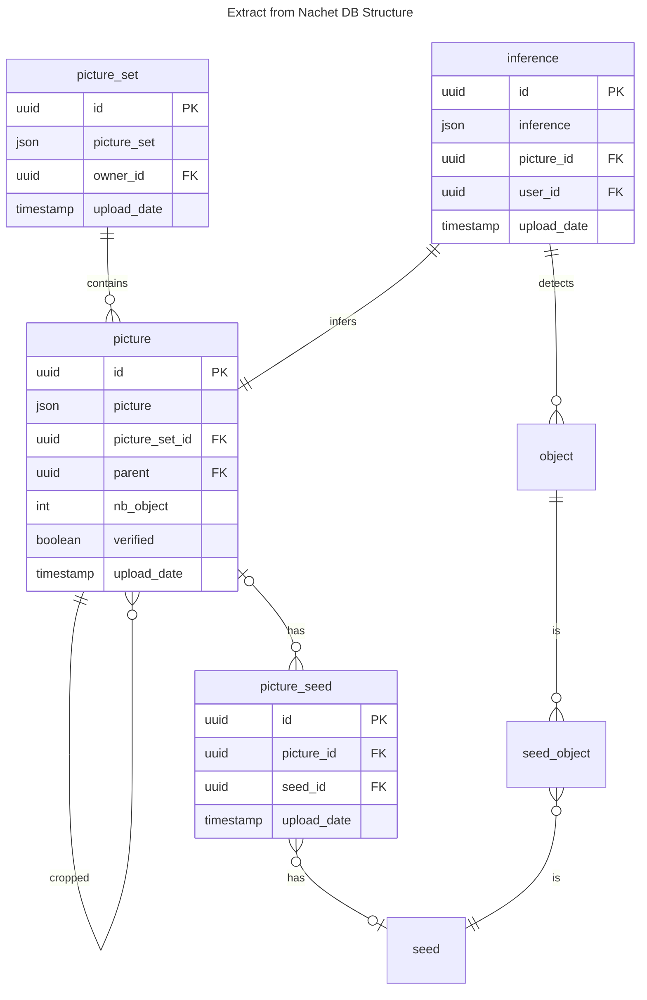
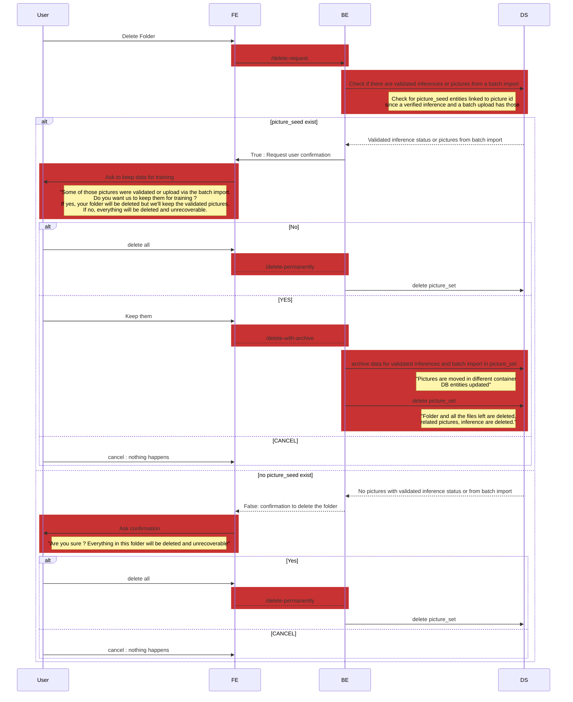
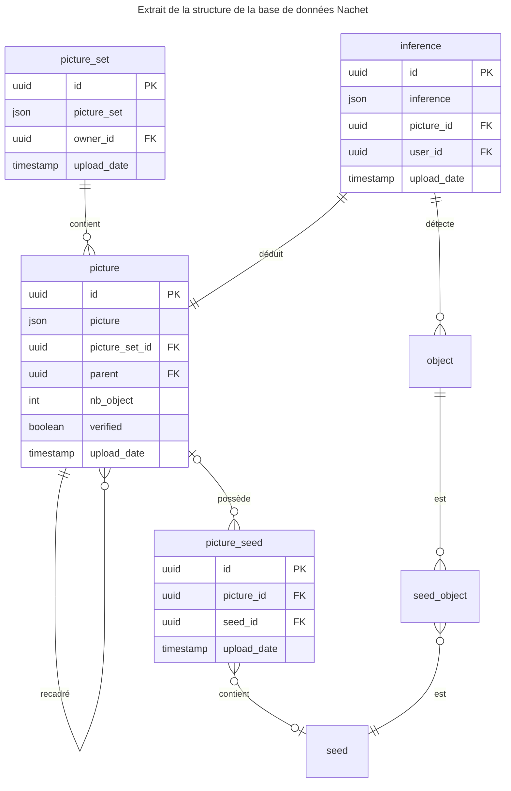
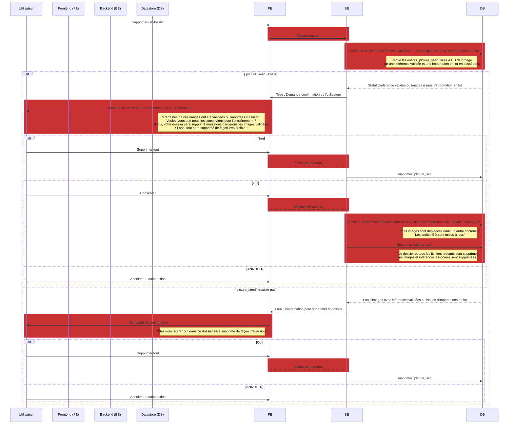

# Manage folders

([*Le français est disponible au bas de la page*](#gérer-les-dossiers))

## Executive summary

A user is able to have a preview of his blob storage container in the Nachet
application. He can have many folders in his container and pictures in it. Since
we have the database, those folders are related to the picture_set table and
each picture is also saved in the database. Here is its schema:



From the Nachet Interactive application, a user can create and delete folders,
so the blob storage and the database must be correctly updated.

When a folder is created, it takes on a name and is created as a `picture_set`
in the database and as a folder in the blob storage container of the user.

There are more issues when the user wants to delete a folder. If the folder
contains validated pictures, it may be useful for training purpose, because it
means there is a valid inference associated with each seed on the picture. The
same applies to pictures imported in batches, which have been downloaded for
training purposes. Our solution is to request confirmation from the user, who
can decide to delete pictures from his container but let us save them, or he can
delete everything anyway, for example if there has been a missed click.

## Prerequisites

- The user must be signed in and have an Azure Storage Container
- The backend needs a connection to the datastore

## Sequence Diagram

### Delete use case



## API Routes

### /create-dir

The `create-dir` route needs a `folder_name` and creates the folder in the
database and in Azure blob storage.

### /get-directories

The `get-directories` route retreives all user directories from the database
with their pictures as a JSON. There are 4 different cases for the pictures :

| **is_verified \\ inference_exist** | **false**              | **true**             |
|------------------------------------|----------------------|-----------------------|
| **false**                           | *should not happend* | inference not verified  |
| **true**                          | batch import | inference verified |

```json
{
"folders" : [
        {
            "picture_set_id" : "xxxx-xxxx-xxxx-xxxx",
            "folder_name" : "folder name",
            "nb_pictures": 4,
            "pictures" : [
                {
                    "picture_id" : "xxxx-xxxx-xxxx-xxxx",
                    "inference_exist": false,
                    "is_validated": true
                },
                ...
            ]
        },
        ...
    ]
}
```

### /get-picture

The `get-picture` route retreives the selected picture as a JSON :

```json
{
    "picture_id" : "xxxx-xxxx-xxxx-xxxx",
    "inference": {
     }
    "image": "data:image/...;base64,xxxxxxxx"
}
```

### /delete-request

The `delete-request` route returns True if there are validated pictures in the
given folder or else returns False.

### /delete-permanently

The `delete-permanently`route deletes the given folder, meaning it deletes the
`picture_set` and everything related in the database, as well as all blobs in
the Azure blob storage.

### /delete-with-archive

The `delete-with-archive` route deletes the given folder from the user container
but moves everything in the dev container.

---

## Gérer les dossiers

## Sommaire

Un utilisateur peut obtenir un aperçu de son conteneur de stockage blob dans
l'application Nachet. Il peut posséder plusieurs dossiers dans son conteneur
ainsi que des images. Étant donné que nous utilisons une base de données, ces
dossiers sont liés à la table `picture_set`, et chaque image est également
enregistrée dans la base de données. Voici son schéma actuel:



Depuis l'application Nachet Interactive, un utilisateur peut créer et supprimer
des dossiers, ce qui nécessite une mise à jour correcte du stockage blob et de
la base de données.

Lorsqu'un dossier est créé, il reçoit un nom et est enregistré en tant que
`picture_set` dans la base de données et comme dossier dans le conteneur de
stockage blob de l'utilisateur.

La suppression de dossiers pose plus de défis. Si le dossier contient des images
validées, celles-ci peuvent être utiles pour l'entraînement, car elles sont
associées à une inférence valide pour chaque graine présente sur l'image. Il en
va de même pour les images importées en lots, qui ont été téléchargées à des
fins d'entraînement. Notre solution consiste à demander une confirmation à
l'utilisateur, qui peut choisir de supprimer les images de son conteneur tout en
nous permettant de les conserver, ou de tout supprimer en cas de clic
accidentel, par exemple.

## Prérequis

- L'utilisateur doit être connecté et disposer d'un conteneur Azure Storage.
- Le backend doit être connecté au datastore.

## Diagramme de séquence

### Cas d'utilisation : Suppression



## API

### Route /create-dir

`create-dir` nécessite un `folder_name` et crée le dossier dans la base
de données ainsi que dans le stockage blob d'Azure.

### Route /get-directories

`get-directories` récupère tous les répertoires de l'utilisateur depuis
la base de données avec leurs images au format JSON. Il existe 4 cas différents
pour les images :

| **is_verified \\ inference_exist** | **false**              | **true**               |
|------------------------------------|------------------------|-------------------------|
| **false**                          | *ne devrait pas arriver* | inférence non vérifiée |
| **true**                           | importation en lot     | inférence vérifiée      |

```json
{
  "folders": [
    {
      "picture_set_id": "xxxx-xxxx-xxxx-xxxx",
      "folder_name": "nom du dossier",
      "nb_pictures": 4,
      "pictures": [
        {
          "picture_id": "xxxx-xxxx-xxxx-xxxx",
          "inference_exist": false,
          "is_validated": true
        },
        ...
      ]
    },
    ...
  ]
}
```

### Route /get-picture

`get-picture` récupère l'image sélectionnée en format JSON :

```json
{
  "picture_id": "xxxx-xxxx-xxxx-xxxx",
  "inference": {},
  "image": "data:image/...;base64,xxxxxxxx"
}
```

### Route /delete-request

`delete-request` renvoie `True` s'il y a des images validées dans le
dossier donné, ou `False` sinon.

### Route /delete-permanently

`delete-permanently` supprime le dossier spécifié, ce qui inclut la
suppression du `picture_set` et de tous les éléments associés dans la base de
données, ainsi que la suppression de tous les blobs dans le stockage blob
d'Azure.

### Route /delete-with-archive

`delete-with-archive` supprime le dossier donné du conteneur
utilisateur, mais déplace tout son contenu vers le conteneur de développement.
