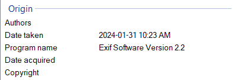
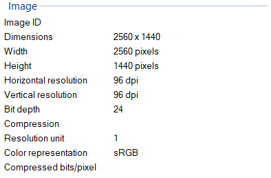
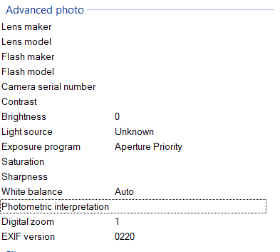

# Tagarno API Objective

## Main objective for milestones 1

The main objective of the Tagarno API integration is to be able to retrieve data
from the image taken by the microscope to build a trust threshold. For example,
we want to build confidence level, base on the condition and configuration a
picture was taken. Having data on this will help build a confidence level in
Nachet prediction.

### Opportunity Tagarno API

---
Tagarno is offering an API that can retrieve and set the config of the
microscope. However, there is no function that return all the config at once.

[Tagarno API
documentation](https://t6x6f6w2.rocketcdn.me/wp-content/uploads/2022/12/TAGARNO-Microscope-API-Documentation.pdf)

### Opportunity Picture Properties

---

When a picture is taken, a lot of metadata is record. See
[exif](#exif-information-in-image) for more.

For example :

**Origin properties of image:**

**Image properties:**

**Camera properties of image:**

**Advanced photo properties of image:**

File properties of image:

Lot's of the recording is also in the Tagarno API (White balance, contrast,
brightness, etc.). If we cross references the data with Tagarno API, we could be
able to only call specific Tagarno function to get a full configuration dataset.

### Tagarno API Get functions

|Function|Configuration|
|---|---|
|getSerial|Request the serial number of the microscope|
|getVersion|Request the application version of the microscope|
|getFieldOfView|Request the current horizontal filed of view in micromillimiter|
|getZoomDirect|Request the current zoom directly from the camera module|
|getFocusDirect|Request the current focus directly from the camera module|
|getAutoFocusMode|Request the current focus mode|
|getAutoExposureMode|Request the current exposure mode|
|getExposureCompensation|Request the current exposure compensation|
|getManualIris|Request the current manual Iris value|
|getManualGain|Request the current manual gain value|
|getManualExposureTime|Request the current manual exposure time|
|getContrast|Request the position of the Contrast slider in Advanced camera settings|
|getSaturation|Request the position of the Saturation slider in Advanced camera settings|
|getSharpness|Request the position of the Sharpness slider in Advanced camera settings|
|getNoiseReduction|Request the position of the Sharpness slider in Advanced camera settings|
|getWhiteBalanceCalibration|Request red and blue calibration gain values|

### Other Tagarno API utilitary functions

|Function|params|return|
|---|---|---|
|captureImage|[bmp, tiff, png, jpg]|return base64 encoded image|
|executeWhiteBalanceCalibration|None|Execute white balance calibration|

### Exif information in Image

---

#### What is exif?

Exif (Exchangeable image file format) a standard that specifies formats for
images, sound, and ancillary tags used by digital cameras (including
smartphones), scanners and other systems handling image and sound files recorded
by digital cameras. [Wikipédia](https://en.wikipedia.org/wiki/Exif)

This format record information that is present in the property of a picture
under details.

### Potential issue

---

We need to carefully exchange image. If a transformation occurs during the
exchange process, exif information can be lost. Therefore, we need to valide if
data follow the picture when it goes through the frontend to the backend.

### List of validation

---

- [ ] Validate that Tagarno image produce exif metadata
- [x] Validate that image coming from frontend also produced exif metadata :x:
- [ ] Find another way to collect metadata from image if they don't recorded
  exif
- [ ] Incorporate TIFF tag into the functionnality since Tagarno image are .tiff
  extension
- [x] Waiting for Jack to return email on API :x:

### Return on validation

#### Validate that Targano image produce exif metadata

Ongoing

#### Validate that image coming from frontend also produced exif metadata

Nachet frontend send png image to be analyze by the pipelines(list of models).
Therefore, no metadata seems to be taken since PNG file doesn't store exif
information. [png_documentation](https://www.w3.org/TR/png/#11Chunks)

Since we ask the user if we can use is camera, we could explore how the frontend
can access exif data from there, or rewoke the capture picture functionnality to
directly took a picture from the camera that is connected in JPG or TIFF format.
As confirmed by Taran, TIFF format is used at the laboratory and was used to
train our models.

#### Find another way to collect metadata from image if they don't recorded

Ongoing

#### Incorporate TIFF tag into the functionnality since Tagarno image are .tiff

Ongoing

#### Waiting for Jack to return email on API

It was confirm by Anders Ravnskjaer Pedersen (after Jake from Tagarno ask him)
that there is no functionnality in the API that return all the microscope
configuration at once.

In the same email chain, Jill Gagnon confirm that we could not have an extension
on our API trial. The invoice was forwaded by Ricky to Noureddine.

### get exif function

```mermaid
sequenceDiagram
    actor Client
    participant Frontend
    participant Backend
    participant Microscope Modul
    participant Blob Storage

    Client-)Frontend: Upload picture
    Frontend-)Backend: HTTP POST req.
    Backend-)Backend: inference_request()
    note over Backend, Blob Storage: While in inference call <br> see inference doc
    Backend-)Microscope Modul: get_picture_details(data)
    note over Backend, Microscope Modul: Need to validate what data is pass <br> to the function image or path ?
    Microscope Modul-)Backend: return exif_dict
    Backend-)Blob Storage: HTTP POST req.
    note over Backend, Blob Storage: Storing metadata and image path with the rest of the inference result
```
